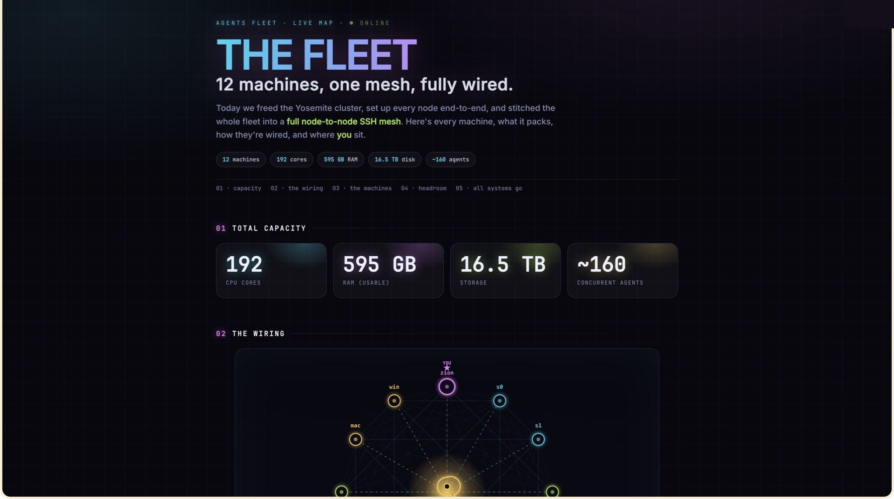
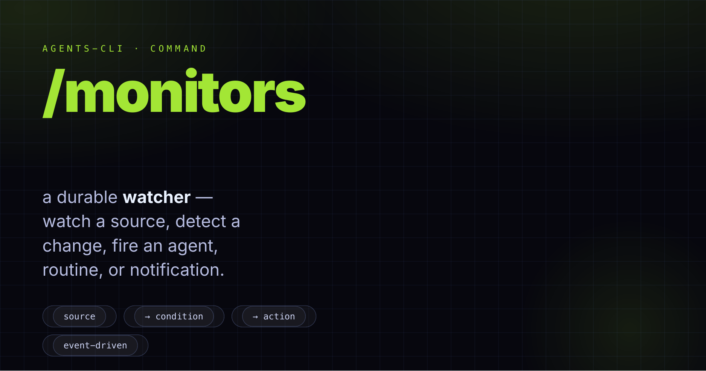
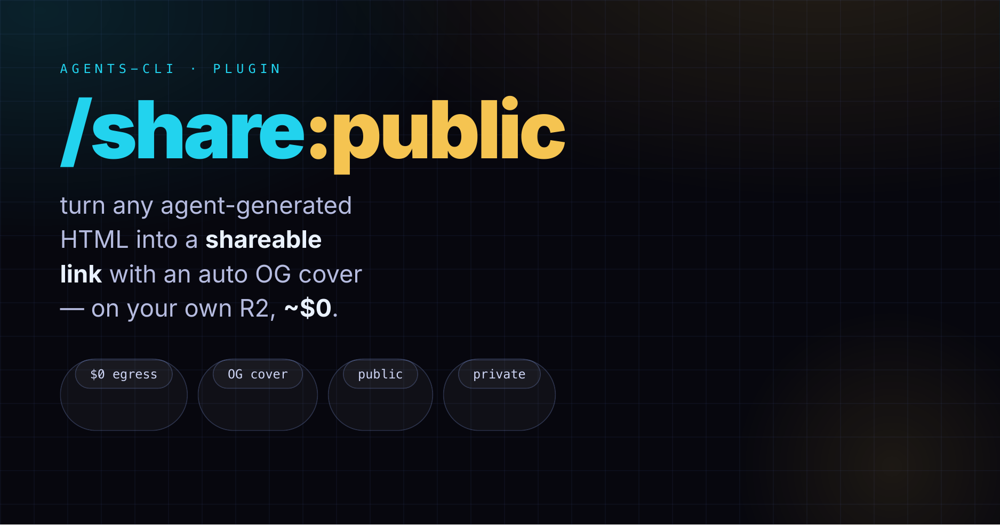

<p align="center">
  
</p>

<h1 align="center">.agents-system</h1>

<p align="center">
  <b>The system layer for <a href="https://www.npmjs.com/package/@phnx-labs/agents-cli">agents-cli</a></b><br>
  npm-shipped defaults — commands, skills, plugins, hooks, rules, and permissions — that every agent inherits.
</p>

<p align="center">
  <a href="https://www.npmjs.com/package/@phnx-labs/agents-cli"></a>
  
  
  
</p>

<p align="center">
  &nbsp;&nbsp;
  &nbsp;&nbsp;
  &nbsp;&nbsp;
  &nbsp;&nbsp;
  
</p>

---

## What this is

`agents-cli` uses **layered configuration** — four repos with the same shape but different roles:

| Repo | Role | Edited by |
|---|---|---|
| `<project>/.agents/` | **Project** — repo-specific overrides | Project maintainers |
| `~/.agents/` | **User** — your personal additions and overrides | You |
| `~/.agents-<alias>/` | **Extras** — optional opinionated bundles (opt-in) | Bundle authors |
| `~/.agents-system/` (this repo) | **System** — npm-shipped defaults | Upstream PRs |

Resources resolve **project → user → extras → system**. A same-named resource at a higher layer wins; everything else unions. One config, materialized into every installed agent — Claude, Codex, Gemini, Cursor, OpenCode, and more.

## Quick start

```bash
npm install -g @phnx-labs/agents-cli
agents view          # show what's installed across every agent + version
```

## What's tracked

```
.agents-system/
  commands/        # slash commands (/plan, /debug, /output, /monitors, ...)
  skills/          # capabilities (agents-cli, browser, teams, sessions, ...)
  plugins/         # bundled plugins (cloud, code, fleet, git, share, social, swarm)
  hooks/           # lifecycle scripts + hooks.yaml manifest
  rules/           # AGENTS.md + modular rule fragments
  permissions/     # permission groups + presets
```

Each directory has its own README. Plugins are registered in [`.claude-plugin/marketplace.json`](.claude-plugin/marketplace.json) and synced to every installed agent version.

## Commands

Slash commands are prompt templates — `commands/<name>.md` becomes `/<name>`, with `$ARGUMENTS` replaced by what you type.

| Command | Purpose |
|---------|---------|
| **Plan & build** | |
| `/plan` | Plan with research, code reading, artifacts, optional team review |
| `/debug` | Root-cause analysis with a full evidence chain |
| `/clean` | Remove tech debt, consolidate duplicates |
| `/test` | Test critical paths with parallel validation |
| **Ship & review** | |
| `/commit` | Alias of `/code:commit` — split into max logical commits, push in background |
| `/review` | Alias of `/code:review` — review every PR the session opened, then merge / request-changes per verdict |
| `/done` | Verify work is complete, test, release, file tickets for the remainder |
| `/finish` | Drive the current task to done end-to-end instead of stopping at a recap or partial handoff |
| `/prune` | Delete merged branches and worktrees, locally and on origin (conservative) |
| **Recap & resume** | |
| `/recap` | Summarize state — facts first, hypotheses grounded |
| `/continue` · `/recover` · `/restore` | Resume one session / recover many crashed sessions / restore state |
| `/hibernate` | Sleep this same session until a future time, then wake it (full context) to check on a long wait |
| **Coordinate** | |
| `/tickets` | Work with the issue tracker (auto-detects Linear/GitHub/Jira) |
| `/teams` | Spawn parallel agents for a task |
| **Observe** | |
| `/monitors` | Set up a durable event-triggered watcher — watch a source, fire an agent/routine/notification on change |
| `/output` | Fleet-wide token-burn + shipped-output report over a window, rendered as an HTML dashboard + PDF |

<p align="center">
  
</p>

Several commands escalate to `agents teams` for complex scopes (debug, plan, clean, test, recap, review).

## Skills

Skills are richer than commands — multi-file capabilities with persistent context. The full set ships in [`skills/`](skills/); highlights:

| Skill | Purpose |
|-------|---------|
| `agents-cli` | Manage agent CLIs, versions, config |
| `browser` | Drive browsers for automation |
| `computer` | Drive native macOS apps (screenshot, click, type) |
| `teams` | Organize agents into parallel teams |
| `run` / `routines` | Dispatch a single agent / schedule recurring agents |
| `sessions` | Search and read prior agent transcripts |
| `secrets` | Keychain-backed env-var bundles |
| `docs` / `release` | Write docs / publish packages |
| `learn` | Reflect on a finished session and fold durable lessons back into skills/rules/memory |

See [`skills/README.md`](skills/README.md) for the complete table. Invoke with `/skillname`, or let the agent invoke when relevant.

## Plugins

Plugins bundle related skills, commands, hooks, and subagents into one installable unit. The system layer ships lightweight, no-paid-key plugins by default; heavier or key-gated plugins live in `.agents-extras`.

| Plugin | Purpose |
|--------|---------|
| `cloud` | Rush Cloud dispatch — `/cloud:run` runs a prompt on a managed cloud worker that opens a PR; `/cloud:accounts` wires Rush + Claude/Codex credentials |
| `code` | The coding loop — `/code:loop`, `/code:dispatch`, `/code:verify`, `/code:review`, `/code:ship`, `/code:sprint`, `/code:quality`, `/code:learn`, `/commit` |
| `fleet` | Fleet-wide ops across every machine you've registered — `/fleet:sync` pulls every repo to latest on every device and refreshes all agents (never clobbers local work); `/fleet:onboard` brings a bare device to parity |
| `git` | Pure git plumbing — `/git:prune` prunes merged branches/worktrees with hard data-loss guards; `/git:tag-release` cuts and pushes an annotated release tag |
| `share` | Publish an agent-generated HTML artifact to a shareable link on your own Cloudflare R2 (~$0) — `/share:public` (auto OG cover) / `/share:private` (unlisted, auto-expiring) |
| `social` | Turn a content agent's post archive into strategy — `/social:audit`, `/social:align`, `/social:schedule` |
| `swarm` | Fan a task across a team of parallel agents — `/swarm:plan`, `/swarm:debug`, `/swarm:test`, `/swarm:qa` |

<p align="center">
  
</p>

## Rules

`rules/AGENTS.md` is the canonical instruction file, synced as `CLAUDE.md`, `GEMINI.md`, and `.cursorrules` per agent. Modular fragments in `rules/subrules/` compose in.

## Hooks

`hooks.yaml` registers scripts against agent lifecycle events (`SessionStart`, `UserPromptSubmit`, `Stop`). Key hooks expand `#shortcut` tokens, execute inline `! cmd` bang commands, and inject context at session start. User overrides go in `~/.agents/agents.yaml` under `hooks:`.

## Going further — extras bundles

This repo is the lean, universal default. Heavier opt-in workflows — parallel coding loops, branded media generation — ship as separate **extras** bundles you layer in with one command (above system, below your user repo):

```bash
agents repo add gh:phnx-labs/.agents-extras   # /loop, /sprint, /dispatch, /verify, /animate, /image, /compose, /design
agents repo list                              # confirm it registered
```

Extras are kept out of system on purpose — they carry heavier dependencies and paid API keys, so the default install stays fast and works on any OS with no setup. Disable anytime with `agents repo disable <alias>`.

## Customization

Fork this repo, make changes, set it as upstream:

```bash
agents repo set gh:your-handle/.agents-system
agents pull
```

Or just add overrides to `~/.agents/` — same structure, user layer wins.

## Local-only (gitignored)

Runtime state written here but never committed: `versions/`, `shims/` (installed CLIs); `sessions/`, `teams/`, `swarm/` (execution state); `agents.yaml`, `*.log`, `*.pid` (local config and logs).

## License

MIT
